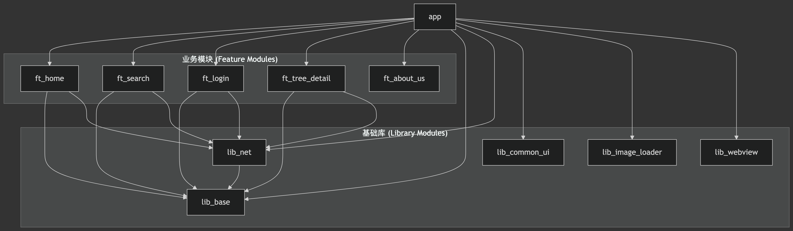

## DemoApp
java 11
gradle 6.7

项目是一个典型的 组件化 + MVVM 架构的 Android 应用。

核心技术栈：项目主要采用 Kotlin 语言开发，并整合了以下主流技术：
- Jetpack：广泛使用了 ViewModel、Navigation、Paging 等 Jetpack 组件。
- Coroutines (协程)：用于处理异步任务和网络请求，简化线程管理。
- Retrofit：作为网络请求库，与协程结合使用。
- Koin：一个轻量级的依赖注入框架，非常适合 Kotlin 项目。
- ARouter：一个用于组件化开发的路由框架，负责模块间的页面跳转和服务调用。

架构模式 (MVVM)：
项目遵循 MVVM（Model-View-ViewModel）设计模式。

View：通常是 Activity 或 Fragment，负责 UI 展示和用户交互。

ViewModel：负责业务逻辑处理和数据管理，为 View 提供其所需的数据。它通过 ViewModel、LiveData (或 StateFlow/SharedFlow) 实现，具有生命周期感知能力。

Model：负责数据获取，通常是 Repository 层，它会协调从网络（Remote）或本地数据库（Local）获取数据。

组件化 (Componentization)：

项目被拆分成了多个独立的模块，实现了业务功能的高内聚和模块间的低耦合。

宿主 app 模块本身不包含任何具体的业务逻辑，它的主要作用是作为一个“壳”，集成和组装所有的业务模块和功能模块。

模块间的通信完全依赖 ARouter，避免了模块间的直接引用和依赖。

模块划分与依赖关系

从 settings.gradle 和各个模块的 build.gradle 文件中，我们可以清晰地看到模块的划分和它们之间的依赖关系。

模块列表

项目主要包含三类模块：

应用模块 (Application Module)：

app：项目的主模块和入口，负责打包成最终的 APK。

业务模块 (Feature Modules)：以 ft_ 开头，代表各项独立的功能。

ft_home：首页功能模块（包含项目、导航、体系、我的等 Tab）。

ft_search：搜索功能模块。

ft_login：登录功能模块。

ft_tree_detail：知识体系详情页模块。

ft_about_us：关于我们模块。

基础库模块 (Library Modules)：以 lib_ 开头，提供通用的功能支持。

lib_base：基础库，包含工具类、ARouter 路径常量 (ConstantsPath.kt)、BaseActivity/Fragment 等。

lib_net：网络库，封装了 Retrofit 和网络请求逻辑。

lib_common_ui：通用 UI 组件库。

lib_image_loader：图片加载库，封装了 Glide。

lib_webview：封装了通用的 WebView 功能。

app 模块 位于最顶层， 它依赖所有的业务模块（ft_*）和基础库模块（lib_*）， 将它们集成在一起，构成一个完整的应用。

业务模块 (ft_*) 位于中间层。它们之间 没有直接依赖，完全解耦。当需要交互时（例如从首页跳转到搜索页），它们会通过 ARouter 来实现。这些模块通常会依赖一个或多个基础库模块以获得通用功能支持（如网络请求、基础工具等）。

基础库模块 (lib_*) 位于最底层，为上层模块提供服务。它们是项目的基础，通常具有高复用性。

依赖注入 (Koin)

项目使用 Koin 进行依赖注入，进一步提升了代码的解耦和可测试性。

每个业务模块（如 ft_login 中的 LoginModule.kt）都有自己的 Koin module，在其中定义自身的 ViewModel 和 Repository 的创建方式。

最后，在 app 模块的 di/allModule.kt 文件中，将所有业务模块的 Koin module 聚合到一个 allModule 列表中。

在 App.kt 的 onCreate 方法中，通过 startKoin 启动 Koin 并加载 allModule，从而完成了整个应用的依赖关系图构建。

总结

jetpack-mvvm-copy 是一个结构清晰、技术栈现代化的 Android 项目范例。它通过 组件化 实现了模块解耦和并行开发，通过 MVVM 实现了业务逻辑和 UI 的分离，并借助 Koin 和 ARouter 等优秀框架简化了开发。这种架构非常适合中大型团队协作开发和长期维护。